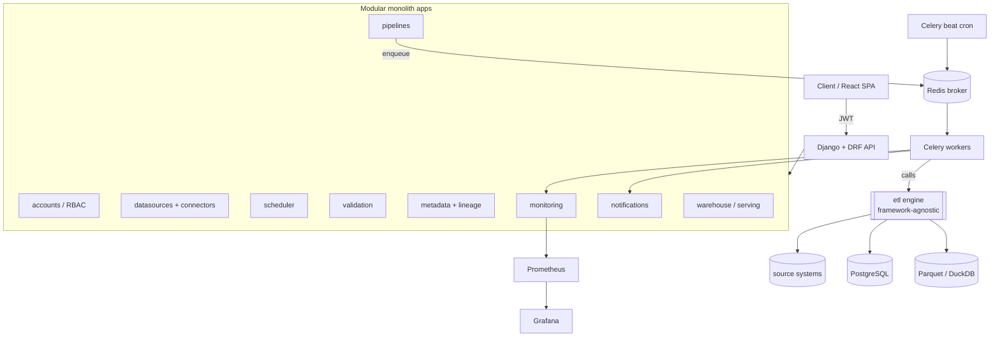
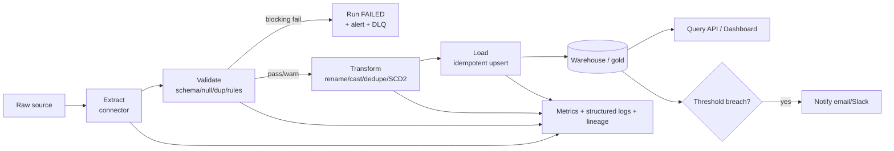
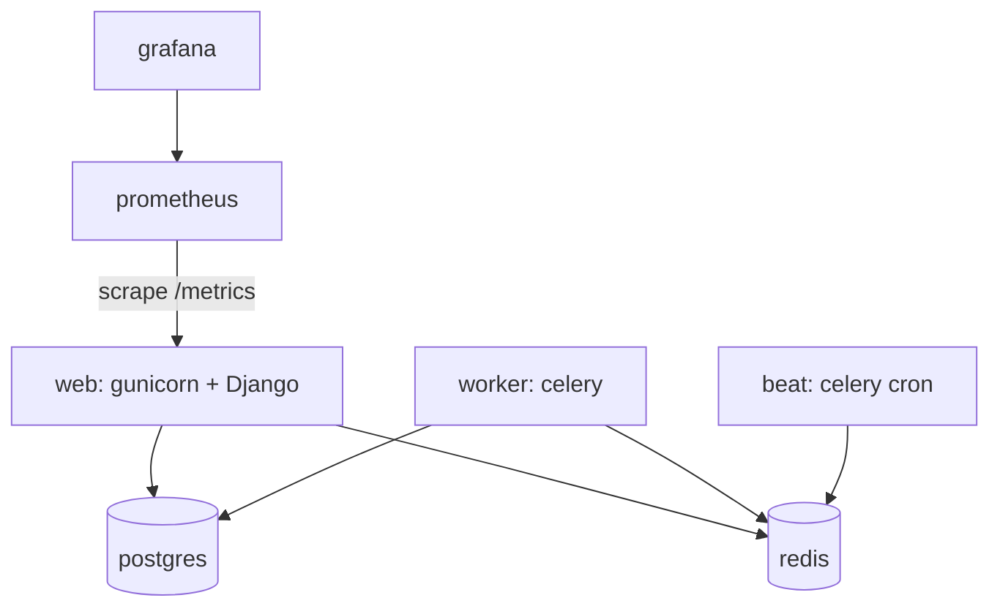
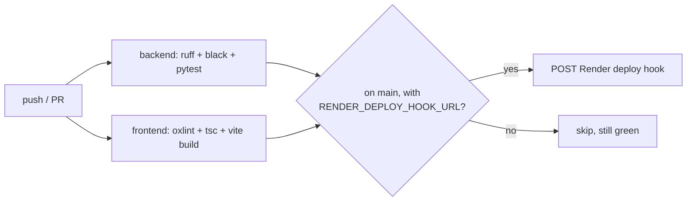

# Architecture

DataFlow Studio is a **modular monolith**: one deployable Django application composed of
independent apps (bounded contexts), with heavy work pushed to Celery workers. This gives the
maintainability and clean boundaries of services without the operational tax of a distributed
system at portfolio scale.

## System context

```mermaid
flowchart LR
    User([Engineer / Analyst])
    Admin([Platform Admin])
    Ext[(External sources:\nFiles · Postgres · REST APIs)]

    subgraph DFS[DataFlow Studio]
      API[REST API + OpenAPI]
      UI[React Dashboard]
      Core[Pipeline / ETL / Validation core]
      Store[(PostgreSQL)]
      Lake[(Parquet + DuckDB\nbronze/silver/gold)]
      Obs[Metrics · Logs · Traces · Alerts]
    end

    User --> UI --> API
    Admin --> API
    API --> Core
    Core --> Ext
    Core --> Store
    Core --> Lake
    Core --> Obs
```

## Components (containers)

## ETL execution flow

**Lifecycle in words:** a source is registered → a pipeline defines its validation, transform, and
target specs → the pipeline is run (manually, via API, or on a cron schedule) → a Celery worker
invokes the framework-agnostic ETL engine → the engine extracts, validates (blocking checks can
stop the run), transforms, and idempotently loads into the warehouse → every step emits metrics,
structured logs, and lineage → the served data is queryable over the API and dashboard →
threshold breaches or failures raise alerts and, if needed, land failed records in a dead-letter
record for reprocessing.

## Deployment (docker-compose topology)

The same topology deploys to Render as-code via `render.yaml` (a Blueprint: web + worker + beat +
managed Postgres + managed Redis) — see [`docs/05-deployment.md`](05-deployment.md).
Prometheus/Grafana aren't part of the Render deploy (no free-tier host for them); they're a
docker-compose-only concern for now.

## CI/CD (v0.9)

`.github/workflows/ci.yml` runs `backend` and `frontend` on every push/PR; `deploy` only runs on
`main` and only calls out to Render if the deploy-hook secret is configured, so a fork or PR build
never fails for lacking deploy access.

## Why each choice — and what was rejected

| Decision            | Chosen                    | Why                                                        | Rejected & why not                                                                 |
|---------------------|---------------------------|------------------------------------------------------------|------------------------------------------------------------------------------------|
| API framework       | Django + DRF              | Batteries-included: ORM, auth, admin, migrations, mature DRF | FastAPI (would hand-roll ORM/admin/migrations); Flask (too much assembly)           |
| Task queue          | Celery + Redis            | De-facto standard, cron via beat, retries, huge ecosystem   | RQ/Dramatiq (lighter but fewer features); OS cron (no retries/visibility)           |
| OLTP database       | PostgreSQL                | JSONB, window functions, reliability, industry default      | MySQL (weaker JSON/analytics); MongoDB (relational modeling here is a better fit)   |
| Analytics/medallion | DuckDB + Parquet          | Lakehouse patterns locally, zero cloud cost, blazing OLAP   | Spark (huge for portfolio scale); Snowflake/BigQuery (needs cloud + spend)          |
| Architecture        | Modular monolith          | Clean boundaries, one deploy, easy local dev + demo         | Microservices (network, infra, and observability overhead unjustified at this size)|
| Auth                | JWT (SimpleJWT) + RBAC    | Stateless, standard for SPA/API, simple to reason about     | Session cookies (worse for SPA/mobile); OAuth server (overkill for internal tool)   |
| Observability       | Prometheus + Grafana + JSON logs + OTel | Industry-standard metrics/dashboards/tracing  | Cloud-only APM (cost + vendor lock-in for a local-first project)                    |
| Docs                | drf-spectacular (OpenAPI) | Auto-generated, always in sync, Swagger UI                  | Hand-written docs (drift out of date immediately)                                   |
| Hosting             | Render (free tier, Blueprint) | Postgres+Redis+multi-service free tier, deploy-as-code, zero card required | Fly.io (less generous free Postgres); Heroku (no free tier anymore); AWS/GCP (way over-provisioned for portfolio scale) |
| CI                  | GitHub Actions            | Free for public repos, native to where the code already lives | CircleCI/Travis (another account, no material benefit here)                       |
| Load/chaos tooling  | Locust + a docker-compose kill/recreate script | Locust already Python (matches the stack); the chaos scenario only needs `docker kill`/`docker compose up`, no dedicated framework | Chaos Mesh/Gremlin (Kubernetes-oriented, this project isn't on k8s)                |

## Cross-cutting concerns

- **Security:** JWT + RBAC + workspace isolation; Fernet-encrypted credentials; audit logs; rate
  limiting; PII masking; least privilege. (v0.7)
- **Delivery & resilience:** CI on every push/PR (lint + test + build), deploy-as-code (Render
  Blueprint), a load test proving the API stays fast under concurrent users, and a chaos test
  proving a run recovers cleanly if the worker processing it dies mid-flight. (v0.9)
- **Reliability:** idempotent loads, retries with backoff, blocking validation, dead-letter records,
  health checks. (v0.2, v0.3)
- **Scalability path:** stateless API behind more gunicorn workers; add Celery workers horizontally;
  partition Parquet; batch tuning; connection pooling. Documented, not all built at portfolio scale.
- **Data quality:** validation engine + scorecards with historical trend. (v0.3)
- **Governance:** metadata catalog + table/column lineage + schema history. (v0.4)
